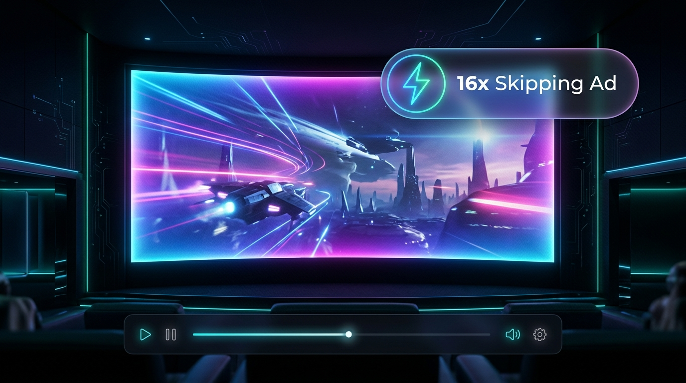

# JioHotstar Ad Skipper & Blocker ⚡

[](https://mihirverma7781.github.io/jio-hotstar-ad-blocker/)
[](https://github.com/mihirverma7781/jio-hotstar-ad-blocker/stargazers)
[](LICENSE)

> 🌐 **Official Website & Interactive Simulator**: [https://mihirverma7781.github.io/jio-hotstar-ad-blocker/](https://mihirverma7781.github.io/jio-hotstar-ad-blocker/)

A Chrome Extension (Manifest V3) designed to automatically fast-forward, mute, and skip in-video advertisements on **JioHotstar** (`hotstar.com`), **JioCinema** (`jiocinema.com`), and **JioStar** (`jiostar.com`).

Modeled after popular OTT ad-skippers (like *Ad Skipper for Prime Video*), this extension provides an uninterrupted, seamless viewing experience without breaking video playback streams.

---

<p align="center">
  <a href="https://mihirverma7781.github.io/jio-hotstar-ad-blocker/">
    
  </a>
</p>

---

## 🌐 Landing Website & Live Demo

Visit the [Live Project Website](https://mihirverma7781.github.io/jio-hotstar-ad-blocker/) to explore:
* **Interactive Ad Bypass Simulator**: Test how the extension detects ad cues, silences audio, and accelerates through commercials at 16x speed.
* **Feature Breakdown**: Detailed look at the multi-layered in-video speedup and cosmetic banner purge.
* **Visual Previews**: Screenshots of the extension popup dashboard and cinema mode HUD.

---

## 🚀 Key Features

* **⚡ Ultra-Fast Playback (up to 16x)**: When an in-video advertisement is detected, playback speed is instantly accelerated to 16x, compressing 30-second ad breaks down to less than 2 seconds.
* **🔇 Auto-Mute & Volume Restore**: Silences ad audio automatically while active, and cleanly restores your previous listening volume once your show or movie resumes.
* **⏩ Auto-Click "Skip Ad" Buttons**: Instantly detects and clicks "Skip Ad", "Skip", "Skip Intro", and "Skip Recap" buttons the exact millisecond they become clickable.
* **🎯 Instant Seek**: Attempts to seek directly to the end of seekable pre-roll and mid-roll ad segments.
* **🚫 In-Webapp Banner & Billboard Purge**: Removes invasive homepage billboard ads, companion promo cards, and subscription nudges for a clean interface.
* **🕶️ Blur / Dim Screen Veil**: Minimizes disruptive, loud visual ads by applying a subtle blur veil with an unobtrusive *"Skipping Ad ⚡"* HUD indicator.
* **🛡️ Network Tracking Filter**: Employs Manifest V3 `declarativeNetRequest` rules to suppress external telemetry and ad trackers.
* **📊 Real-time Dashboard**: Track your total number of ads skipped and total hours/minutes saved directly in the popup interface.

---

## 🛠️ How It Works (Safe, Zero-Freeze Architecture)

1. **Pure Isolated Content Script (`content/detector.js`)**: Runs in Chrome's safe isolated sandbox with zero risk of interfering with Widevine DRM or encrypted DASH streaming chunks. Uses a lightweight 250ms scanner consuming near 0% CPU.
2. **Accurate In-Video Ad Detection**: Directly detects Hotstar's in-video cues:
   * `"Go Ads free"` button
   * `"Ad · 00:xx"` / `Ad • mm:ss` countdown timer
   * `Ad 1 of 2`
3. **Multi-Video Acceleration**: Automatically targets and speeds up all active `<video>` elements to 16x speed and mutes loud commercial audio.
4. **Cosmetic & Network Filtering (`rules/ad_rules.json` & `content/styles.css`)**: Suppresses external telemetry (Scorecard, Conviva, Pubmatic, etc.) and hides cosmetic ad banners.

---

## 📦 Installation Instructions (Chrome / Brave / Edge)

1. Clone or download this repository:
   ```bash
   git clone https://github.com/mihirverma7781/jio-hotstar-ad-blocker.git
   ```
2. Open your Chromium browser (Google Chrome, Brave, Microsoft Edge, Opera, or Vivaldi).
3. Navigate to `chrome://extensions/` in your address bar.
4. Enable **Developer mode** using the toggle in the top-right corner.
5. Click the **"Load unpacked"** button in the top-left corner.
6. Select the cloned project directory:
   ```bash
   path/to/jio-hotstar-ad-blocker
   ```
7. The **JioHotstar Ad Skipper & Blocker** extension is now installed and active!
8. Pin the extension icon to your browser toolbar for quick access to settings and statistics.

---

## ⚙️ Customization Options

Click the extension icon in your browser toolbar to customize:
* **Master Switch**: Toggle the ad skipper on or off anytime.
* **Fast-Forward Speed**: Choose between `16x` (fastest), `8x`, or `4x`.
* **Auto-Mute Ads**: Enable or disable automatic muting.
* **Auto-Click "Skip" Buttons**: Enable or disable automatic clicking of skip prompts.
* **Instant Seek**: Toggle direct seeking for ad clips.
* **Blur / Dim Ad Video**: Toggle the visual veil effect.
* **Skip Intros & Recaps**: Toggle auto-skipping of show intros and recaps.
* **Block In-App Banners**: Toggle hiding of home feed billboard promos.
* **Presenter Mode**: Suppresses on-screen HUD pills and blur transitions during screen-sharing sessions (e.g. Google Meet, MS Teams, Zoom) for a distraction-free presentation.
* **Reset Stats**: Clear accumulated ads skipped and time saved counters.

---

## 🖥️ Screen Sharing & DRM Architecture (Technical Analysis)

### Why Video Appears Black in Google Meet / Teams / Zoom
When sharing a browser tab or window playing protected OTT content, viewers often see standard controls and subtitles, but the actual video area is rendered as a **solid black rectangle**.

Here is the technical architectural explanation:
1. **Encrypted Media Extensions (EME) & CDM**: Commercial video streams on Disney+ Hotstar are encrypted and delivered via EME to an OS/browser Content Decryption Module (such as Google Widevine L1/L3, Microsoft PlayReady, or Apple FairPlay).
2. **Protected Media Path & Hardware Overlay**: The decrypted video frames are rendered directly into a hardware-protected presentation surface managed by the GPU driver and OS window server (Direct3D on Windows, Quartz/WindowServer on macOS).
3. **Capture Prevention (HDCP / Secure Surfaces)**: When a screen-sharing application (Google Meet, Teams, Zoom, Slack) invokes browser display-capture APIs (`navigator.mediaDevices.getDisplayMedia`) or OS capture APIs, the operating system and GPU driver enforce content-protection flags. The hardware compositor intentionally masks the protected video surface with black pixels to prevent unauthorized interception of copyrighted streams.
4. **DOM vs. Video Separation**: Standard HTML/CSS elements (player controls, menus, subtitles) are rendered by the browser's standard DOM rendering pipeline and remain visible during screen capture, while the DRM video layer underneath is blanked.

### Extension Compliance & Presenter Mode
* **Content Protection Integrity**: In accordance with browser security policies and digital rights management standards, this extension **does not** decrypt, tamper with, bypass, or circumvent DRM, EME, Widevine, PlayReady, FairPlay, or HDCP protections.
* **Presenter / Meeting Mode**: When presenting or sharing your browser tab in meetings, enabling **Presenter Mode** ensures that the extension's HUD badges, ad veil filters, and promotional cleanup stay completely unobtrusive, providing a clean, professional window presentation.

---

## 📁 Project Structure

```
jio-hotstar-ad-blocker/
├── index.html                 # Modern minimalist landing page for GitHub Pages
├── style.css                  # Landing page dark glassmorphic styling
├── script.js                  # Interactive ad-bypass simulation player
├── assets/                    # Visual assets for GitHub Pages
│   ├── hero.jpg               # Cinema screen preview graphic
│   └── control-panel.jpg      # Extension popup preview mockup
├── docs/                      # GitHub Pages deployment mirror
├── manifest.json              # Extension Manifest V3 configuration
├── background/
│   └── service_worker.js     # Badge status & statistics manager
├── content/
│   ├── detector.js           # Safe in-video ad detector & 16x speedup engine
│   └── styles.css            # Ad veil & banner cleanup styles
├── popup/
│   ├── popup.html            # Settings & dashboard popup
│   ├── popup.js              # Popup controller logic
│   └── popup.css             # Dark-theme glassmorphism styling
├── rules/
│   └── ad_rules.json         # Declarative Net Request rules
├── icons/                    # Extension icons (16, 32, 48, 128 px)
└── README.md                 # Project documentation
```

---

## 📄 License

This project is licensed under the [MIT License](LICENSE).
